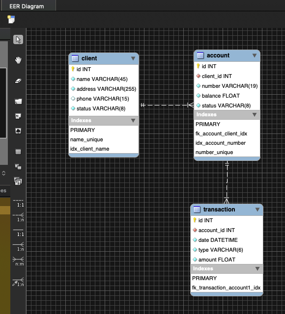
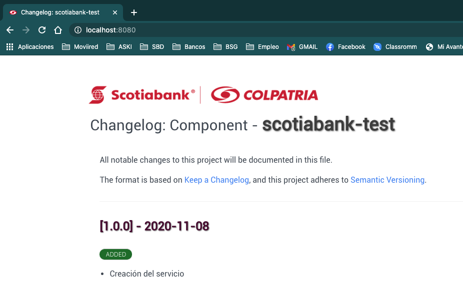

# Scotiabank Colpatria - Prueba técnica
**Autor:** Ronel Rivas

## ERR diagram
A continuación, se prersenta el *Diagrama Entidad-Relación* de la solución propuesta.
  

  
La base de datos seleccionada para el examen es una H2 en memoria, razón por la cual no se necesita configurar ninguna conexión a recursos externos.
  
Dentro de la carpeta *resources/* está un script llamado **data.sql**, que contiene las inserts necesarios para inicializar la BD. Es importante señalar, que el esquema está siendo creado a través de *JPA*.

## Ejecutar el proyecto
Al tratarse de un proyecto *Maven*, realizado con **SpringBoot 2.x**, para ejecutarlo bastará con ejecutar los siguientes comandos:
  
``
    mvn spring-boot:run
``
Al ingresar en su navegador, la dirección: ``http://localhost:8080/scotiabank-test/v1``, se le mostrará el archivo CHANGELOG.md (que está ubidao dentro de la carpeta *resources/static/*), indicando el correcto inicio del proyecto.
  

Otra opción para ejecutar el proyecto, es instalar la imagen de docker creada que está hospedada en el siguiente registro de imágenes:
  
``
    docker pull docker.pkg.github.com/excecrable/scotia-bank/scotiabank-test:1.0.0
``
Esta imagen de docker se creó utilizando el *plugin de maven*, provisto por Google: **JIB**.

* **NOTA:** Este proyecto esta creado utilizando el JDK 11, por lo que sólo podrá ser ejecutado en ambientes con Java 11 o superior. 

## Probar el servicio
En la carpeta ``docs`` del proyecto, se encuentra una coleccion de *Postman*, que le permitará realizar las peticiones al servicio.
 